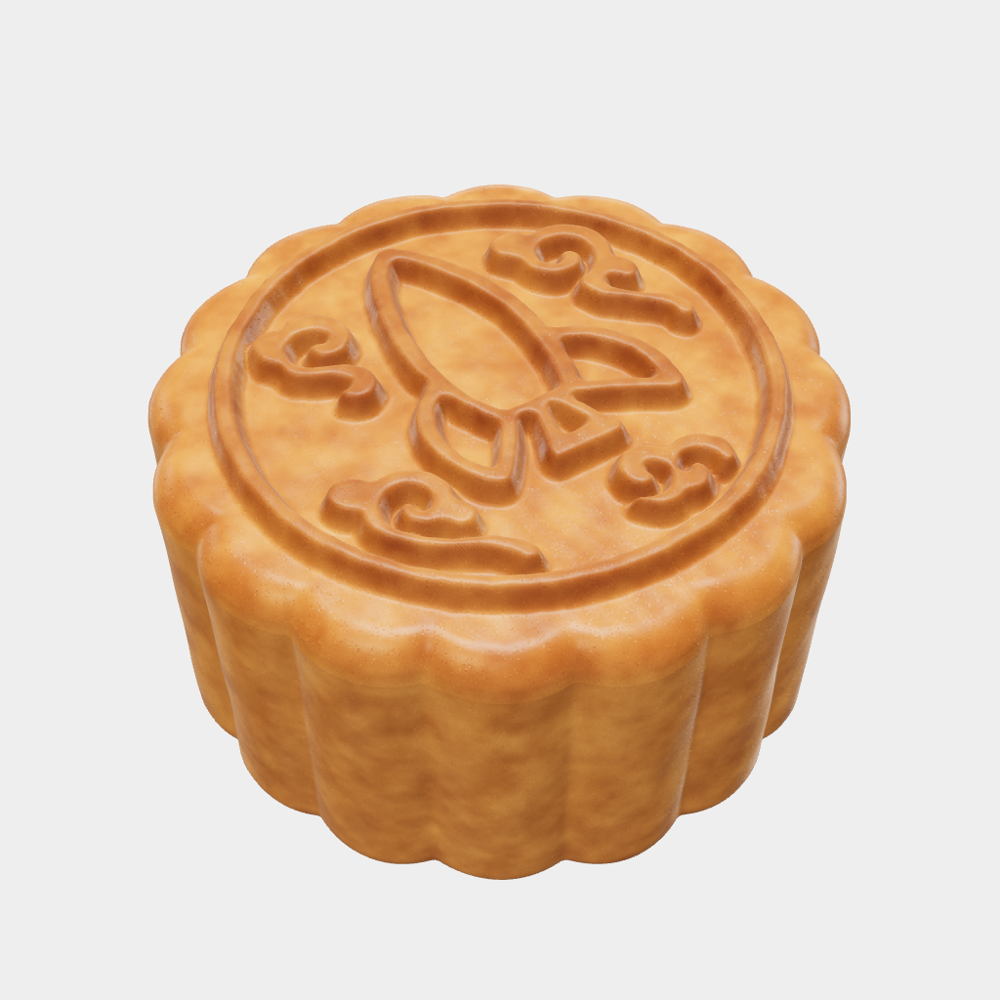
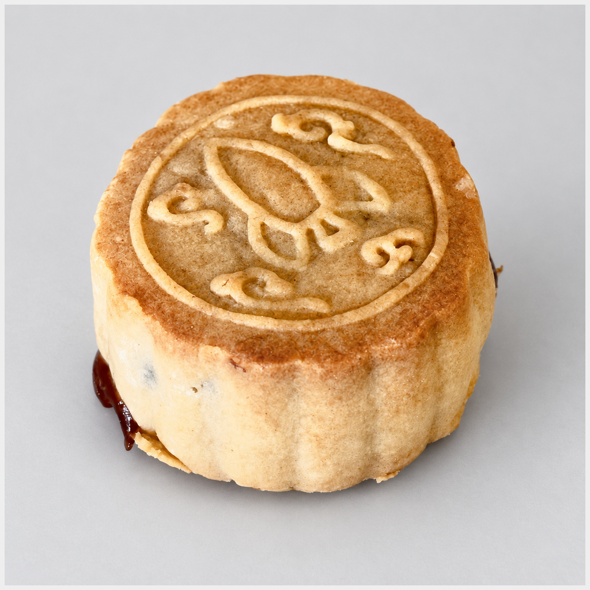

# Mooncake Studio

Design a mooncake and matching printable mold entirely in your browser. Upload black-and-white artwork, adjust the cake and relief, preview the result, and export the mold body, interchangeable design plate, and pusher as STL files.

## [Open Mooncake Studio](https://jonzornow.github.io/mooncake-studio/)

No account or application server is required. Uploaded artwork stays in your browser.

## Preview and baked result

<table>
  <thead>
    <tr>
      <th width="50%">Simulation</th>
      <th width="50%">Baked mooncake</th>
    </tr>
  </thead>
  <tbody>
    <tr>
      <td></td>
      <td></td>
    </tr>
  </tbody>
</table>

Both images use matched 1024 × 1024 framing and closely matched cake scale and viewpoint. The baked photograph was lightly retouched for background, framing, and color; it is illustrative rather than dimensional evidence.

## Use

1. Open **Edit Cake** and choose built-in art or upload PNG, JPEG, WebP, or vector-only SVG artwork.
2. Set the cake profile, design depth, draft, polarity, and edge finish.
3. Inspect the cake and tooling previews.
4. Select **Export mold set** and import the STLs into your slicer as millimeters at 100% scale.

The default 45 mm straight-sided sleeve is the physically tested profile. Cosmetic pastry texture is never exported. Fillets, chamfers, relief, and draft are represented in the STL geometry; real dough release and baking behavior still require a test print and bake.

> **Food-safety warning:** Not all printing materials are food-safe. FDM layer lines can hinder reliable sanitation. This tool does not certify prints for food contact. Use at your own risk, and verify every material and process used for food-contact applications.

## Repository

- [`app/`](app/) — source, artwork, tests, and build tools
- [`release/Mooncake-Studio.html`](release/Mooncake-Studio.html) — self-contained offline build
- [`docs/`](docs/) — development notes and image provenance

For local development:

```sh
cd app
npm ci
npm run dev
```

Run `npm run build:standalone` to rebuild the hosted app and the single-file offline release. See [development notes](docs/DEVELOPMENT.md) for tests and browser support.

MIT License · Copyright 2026 Jonathan Zornow
